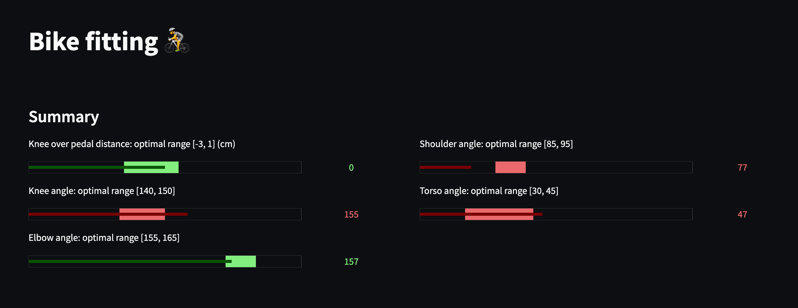

# Open Bike Fitter

#### Intro
The aim of this project is to build an **open source bike fitter**, combining **computer vision** and theoretical **ideal measurements**




#### Setup with local virtual environment 👨‍💻

```
# Create a virtual environment
python3 -m venv myenv

# Activate the virtual environment
source myenv/bin/activate

# Install dependencies from requirements.txt
pip install -r requirements.txt

#  Running the pipeline
python main.py --interactive=True && streamlit run app.py

# Without interactive mode (knee over pedal measurements)
python main.py --interactive=False && streamlit run app.py

```

#### Methodology 🧮
##### 1. Using **OpenCV** and **Mediapipe** open source frameworks
##### 2. Ranges estimation for optimal joint flexions/measurements
1. Reading Video
2. Preprocessing of each **frame**
3. Modelling: single frames and calculating **angles** and **distances**
##### 3. Data viz in **Streamlit**